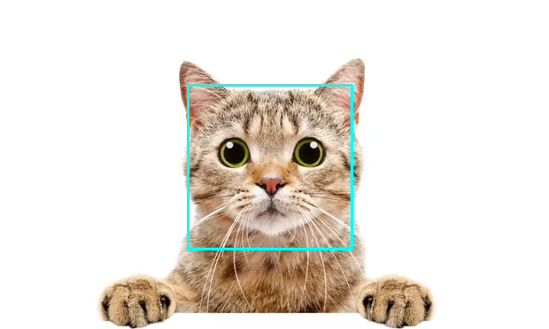

# python-fall-2022

<!-- google meet link: [https://meet.google.com/oyh-zgqx-oir](https://meet.google.com/oyh-zgqx-oir) -->
google meet link: [https://meet.google.com/umh-pgbg-mny](https://meet.google.com/umh-pgbg-mny)


Note: 

- the next APCS exam is on 1/08. The class has been rescheduled for 12/25 from 13:30-15:30. 

------------
## 12-18-2022

Continue working on Final Projects

JSON example [here](https://github.com/cmorace/python-fall-2022/blob/main/Python/json_example/test.py)

Platformer state machine example [here](https://github.com/cmorace/python-fall-2022/blob/main/Python/state_machine_example/test.py)

## 12-11-2022
Design and start implementing final projects

A separate repository for final project notes is here:
[https://github.com/cmorace/PeanutsPythonFinalProject](https://github.com/cmorace/PeanutsPythonFinalProject)

Eric: [CandyCats Repository](https://github.com/duck003/CandyCats.git)

Feng-Jun: [MailModel Repository](https://github.com/NopeIdontthinkso/MailModel)
## 12-04-2022

### Intro to OpenCV



Example 0. Check OpenCV version

```python
import cv2 as cv
print("OpenCV version:", cv.__version__)
```

Example 1. Load, Save, and View an Image

```python
import cv2 as cv
import sys
img = cv.imread("images/baboon.bmp")
if img is None:
    sys.exit("Could not read the image.")
cv.imshow("Display window", img)
k = cv.waitKey(0)
if k == ord("s"):
    cv.imwrite("saved_cv_image.png", img)
```

Example 2. Detect a cat's face in an image

```python
import cv2 as cv
print("OpenCV version:", cv.__version__)
cascade = cv.CascadeClassifier('cat_face_extended.xml')
img = cv.imread("01_cat.webp")
img_gray = cv.cvtColor(img, cv.COLOR_BGR2GRAY)
cats = cascade.detectMultiScale(img_gray, scaleFactor=1.05, minNeighbors=4)
print(len(cats), "cat faces detected")
for (x, y, w, h) in cats:
    cv.rectangle(img, pt1=(x, y), pt2=(x+w, y+h),
                 color=(255, 255, 0), thickness=2)
```

Download the cascade classifier XML file from [here](https://github.com/opencv/opencv/blob/4.x/data/haarcascades/haarcascade_frontalcatface_extended.xml)

### Exercise:

View and save the image showing the detected cat's face. If faces are not detected, tune the parameters for scaleFactor and minNeighbors.

### Extension:

Download other cascade classifiers from [here](https://github.com/opencv/opencv/tree/4.x/data/haarcascades) and detect other objects in an image.

### Additional Resources

- [Learn OpenCV](https://www.learnopencv.com/)

- [https://github.com/spmallick/learnopencv](https://github.com/spmallick/learnopencv)

---------------------
## 11-27-2022
### Review:
- `try/except`, `Exceptions`
- sockets
    - `conn, addr = socket.accept()`
    - `conn.sendto(sent_message.encode(), addr)`
    - `received_message = str(conn.recv(1024), encoding='utf-8')`
    - `conn.close()`
- threads
    - `thread = Thread(target=foo, args=(a,b,))`
    - `thread.start()`

### Python
- implement a multi-threaded server
    ``` text
    Main Thread
    ------------
    set is_waiting_for_connection = False
    while True
        if not is_waiting_for_connection:
            start thread to receive a connection
        for each connection
            if connection is not waiting for message
                start a new receiving thread

    Receive Connection Thread
    ---------------------------
    set is_waiting_for_connection = True
    when receive new connection:
        add connection to list of connections
        send back acknowledgment to cliet
        set is_waiting_for_connection = False 

    Receive Message Thread (every connection has a seperate thread)
    -------------------------
    set connection_is_waiting = True
    try to get a new message
        receive message
        set connection_is_waiting = False
        send acknowledgement back to client
    except error close connection
        close connection
        remove connection from list of connections

    ```
- introduce [multiprocessing module](https://docs.python.org/3/library/multiprocessing.html)
- test out [OpenCV](https://docs.opencv.org/4.x/dc/d4d/tutorial_py_table_of_contents_gui.html), [image loading](https://docs.opencv.org/4.x/db/deb/tutorial_display_image.html), [face detection](https://docs.opencv.org/4.x/db/d28/tutorial_cascade_classifier.html)
- finish C and Linux lesson from last week
## 11-20-2022
### Python Lesson

1. Set up two client windows and one server window and test.

1. Review Reference [socket](https://docs.python.org/3/library/socket.html)

   a. `socket.sendall()` vs. `socket.sendto()` vs. `socket.send()`
   
   b. `socket.accept()`

1. Review `try/except` details. Reference: [errors](https://docs.python.org/3/tutorial/errors.html)

1. Implement `try/except` in server.py

1. Design and implement a state machine for the server.

    a. Clean up the code. Make Server a class.

1. Introduce multi-threading. Reference [threading](https://docs.python.org/3/library/threading.html)

1. Implement multi-threading in server.py

### C Lesson

1. types, arrays, pointers, `sizeof`

2. [memory allocation](https://www.geeksforgeeks.org/dynamic-memory-allocation-in-c-using-malloc-calloc-free-and-realloc/)

3. example of pass-by-value, pass-by-reference, and pass-by-pointer

### Linux Lesson

1. using the [apt](https://help.ubuntu.com/community/AptGet/Howto) package manager

2. introduce [Bash scripting](https://linuxconfig.org/bash-scripting-tutorial)

3. introduce [GNU make](https://linuxhint.com/gnu-make-tutorial/)

#### Homework: Study 'The C Programming Language' book and review Linux references

1. [Linux File System](https://www.tutorialspoint.com/unix/unix-file-system.htm)

2. [Linux File Permissions](https://www.tutorialspoint.com/unix/unix-file-permissions.htm)

3. [Linux File Commands](https://www.tutorialspoint.com/unix/unix-file-commands.htm)

4. [Linux Directory Commands](https://www.tutorialspoint.com/unix/unix-directory-commands.htm)


--------

## 11-13-2022

### Check-in

Is docker-desktop still not working? It would be nice to work in the same environment if possible.

Last week our environments for practicing Linux and C

- Teacher using macOS or Ubuntu with Docker
- Feng-Jun using Ubuntu with WSL (Windows Subsystem for Linux)
- Eric is using git-bash and downloaded MinGW

### Mini Linux(Bash) Lesson


#### The ~/.bashrc file

Aliases

``` bash
alias update-pycat="pip install git+https://bitbucket.org/dwhite0/pycat.git -U"
alias python-class="code <your absolute workspace path>"
alias bashrc="code ~/.bashrc"
alias gcc="<path to gcc.exe>" # for windows
```

Export Path variable

``` bash
export PATH="<bin directory>:$PATH"
```

### Mini C Lesson

Check your C compiler

``` bash
gcc --version
```

Write two functions in C

1. convert from degrees to radians
1. convert from radians to degrees

Compile with `gcc`

### Python Lesson

Server

``` python
import socket
HOST = '127.0.0.1'
PORT = 8000

server = socket.socket(socket.AF_INET, socket.SOCK_STREAM)
server.bind((HOST, PORT))
server.listen(10)

conn, addr = server.accept() # wait until get a message
serverMessage = 'connected to client'
conn.sendall(serverMessage.encode())

while True:
    
    clientMessage = str(conn.recv(1024), encoding='utf-8')

    print('Client message is:', clientMessage)

    serverMessage = 'I\'m here!'
    conn.sendall(serverMessage.encode())
```


Client

``` python
import socket
from pycat.core import Window, Sprite

HOST = '127.0.0.1'
PORT = 8000
clientMessage = 'Hello!'

client = socket.socket(socket.AF_INET, socket.SOCK_STREAM)
client.connect((HOST, PORT))

w = Window(200, 200)


class Button(Sprite):

    def on_create(self):
        self.scale = 100
        self.position = w.center

    def on_left_click(self):
        print("sending to server")
        client.sendall(clientMessage.encode())
        serverMessage = str(client.recv(1024), encoding='utf-8')
        print('Server:', serverMessage)


w.create_sprite(Button)
w.run()
```

1. Make sure we can connect and send messages from client to server with pycat
1. Introduce keywords `try`/`except`
1. Decompose the two-player online game problem

- Design a simplified Server state machine for two player game
- Design a simplified Client state machine for two player game

Can we design a reusable module for a two-player server-client model?

### Homework

- Brainstorm ideas for your final project. The more ideas, the better.
- Continue work on the two-player asteroid game.
- Study python reference material for [multiprocessing](https://docs.python.org/3/library/multiprocessing.html) and [socket](https://docs.python.org/3/library/socket.html)
- Work on previous exam's APCS problems.
- Study and test some code from [The C Programming Language](https://github.com/auspbro/ebook-c/raw/master/The.C.Programming.Language.2Nd.Ed%20Prentice.Hall.Brian.W.Kernighan.and.Dennis.M.Ritchie..pdf) book 

---------


## Lesson 2: 2022-11-06

### APCS questions

My solutions are in the repository. I recommend trying your best to solve them on your own before looking. Note: the solution to question 4 exceeds the time limit for most test cases on ZeroJudge.

### Getting Started with Linux
Linux is an open-source operating system with many distributions to choose from, e.g., Ubuntu, Debian, Red Hat, ArchLinux, CentOS, etc.

There are a few different options for running Linux distributions.

1. Installing a new operating system on your pc is risky and time-consuming. If anything goes wrong, you might have to reinstall. Don't do this unless you have a lot of experience debugging installation and hardware problems with Linux.

2. Dual-boot: Partition your hard drive and install Linux on one of the partitions. One partition runs your current O.S., and the other runs a Linux distribution. Also time-consuming. Less risky than option 1. but requires some experience with Linux and partitioning your disk.

3. Use a virtual machine. We have done this in the past with the APCS environment. A virtual machine is a very safe option but requires some knowledge of the virtualization software, e.g., VirtualBox. Performance is limited.

4. Use a development container with Docker, the safest and easiest method, but you only have access to a shell environment. There is no GUI. Performance is usually better than running a virtual machine. Containers make it easy to set up, test quickly, and deploy different development environments but require some knowledge of Docker.

#### Setting up Docker and Dev-Containers

1. Install [Docker](https://docs.docker.com/get-docker/)
2. Install the [Dev-Containers Extension](https://marketplace.visualstudio.com/items?itemName=ms-vscode-remote.remote-containers)

### A mini Unix Shell lesson

create a file with the `touch <filename>` command

delete a file with `rm <filename>`

create a directory with `mkdir <dirname>`

navigate the filesystem with `cd`

print the working directory with the command `pwd`

show the contents of a file with the commands `cat`, `head`, and `tail`

show the contents of a directory with `ls`

how to use `help`

### Server-Client Example

#### Server

``` python
import socket
HOST = '127.0.0.1'
PORT = 8000

server = socket.socket(socket.AF_INET, socket.SOCK_STREAM)
server.bind((HOST, PORT))
server.listen(10)

while True:
    conn, addr = server.accept()
    clientMessage = str(conn.recv(1024), encoding='utf-8')

    print('Client message is:', clientMessage)

    serverMessage = 'I\'m here!'
    conn.sendall(serverMessage.encode())
    conn.close()
```

#### Client

``` python
import socket

HOST = '127.0.0.1'
PORT = 8000
clientMessage = 'Hello!'

client = socket.socket(socket.AF_INET, socket.SOCK_STREAM)
client.connect((HOST, PORT))


client.sendall(clientMessage.encode())

serverMessage = str(client.recv(1024), encoding='utf-8')
print('Server:', serverMessage)

client.close()
```

--------

## Lesson 1: 2022-10-30

1. Discuss the future of our class
    
    a. Independent Project-Based (self-directed) vs. Planned Lesson (teacher-led)
    
    b. More APCS practice/homework?
    
    c. New directions? C/C++, Unity, Web Programming, 3D Graphics, Computer Vision, Machine Learning, Visualization, Operating Systems/Multi-threading/interprocess-communication, etc.

2. Today's lesson

    a. Look at new pycat projects

    - Asteroids

    - GeoGuesser

    - Animal Crossings
    
    b. Choose a project and start working on it


### Discussion

1. Start with planned lessons
    
    - Add some C programming

    - Add some multiprocess lessons (server/client). Maybe turn Asteroids into a remote two-player game?

    - Add some Linux (Feng-Jun)

2. Do an independent project

3. Continue some APCS (more APCS content closer to the next test date, 2023-01-08)

### Homework (choose one)

1. Look at the most recent APCS problems [https://yuihuang.com/apcs/](https://yuihuang.com/apcs/). Then, work on the solutions and submit them to ZeroJudge. Review questions next class.

2. Continue working on your current Asteroids game.

3. Research/Design a two-player asteroid game.

    a. Two computers with different IP addresses (two clients). One server synchronizes data between the two clients. Therefore, we need two programs, one for the client and another for the server.

    b. Draw a diagram with the clients and server. What messages need to be sent and received for the game to work?

    c. Draw one state-transition diagram for the server application and another for the client applications.

    d. Explain your diagrams in the next class.

    e. Research what python functions can send/receive data between multiple processes?

----

## Install and/or update pycat

```
pip install git+https://bitbucket.org/dwhite0/pycat.git -U
```

clone pycat repo (optional)

```
git clone git@bitbucket.org:dwhite0/pycat.git
```