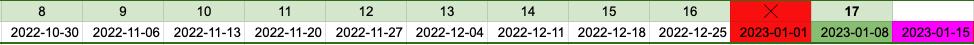

# python-fall-2022

google meet link: [https://meet.google.com/oyh-zgqx-oir](https://meet.google.com/oyh-zgqx-oir)



install and/or update pycat

```
pip install git+https://bitbucket.org/dwhite0/pycat.git -U
```

clone pycat repo (optional)

```
git clone git@bitbucket.org:dwhite0/pycat.git
```

--------

## Lesson 1: 2022-10-30

1. Discuss the future of our class
    
    a. Independent Project-Based (self-directed) vs. Planned Lesson (teacher-led)
    
    b. More APCS practice/homework?
    
    c. New directions? C/C++, Unity, Web Programming, 3D Graphics, Computer Vision, Machine Learning, Visualization, Operating Systems/Multi-threading/interprocess-communication, etc.

2. Today's lesson

    a. Look at new pycat projects

    - Asteroids

    - GeoGuesser

    - Animal Crossings
    
    b. Choose a project and start working on it

3. Tests

    - pycat test

        ``` python
        from pycat.core import Window
        w = Window()
        w.run()
        ```

    - download assets from a markdown source with Github pages
       [asteriods.zip](https://github.com/cmorace/python-fall-2022/raw/main/asteriods.zip)

### Discussion

1. Start with planned lessons
    
    - Add some C programming

    - Add some multiprocess lessons (server/client). Maybe turn Asteroids into a remote two-player game?

    - Add some Linux (Feng-Jun)

2. Do an independent project

3. Continue some APCS (more APCS content closer to the next test date 2023-01-08)

### Homework (choose one)

1. Look at the most recent APCS problems [https://yuihuang.com/apcs/](https://yuihuang.com/apcs/). Then, work on the solutions and submit them to ZeroJudge. Review questions next class.

2. Continue working on your current Asteroids game.

3. Research/Design a two-player asteroid game.

    a. Two computers with different IP addresses (two clients). One server synchronizes data between the two clients. Therefore, we need two programs, one for the client and another for the server.

    b. Draw a diagram with the clients and server. What messages need to be sent and received for the game to work?

    c. Draw one state-transition diagram for the server application and another for the client applications.

    d. Explain your diagrams in the next class.

    e. Research what python functions can send/receive data between multiple processes?

----

## Lesson 2: 2022-11-06

### APCS questions

My solutions are in the repository. I recommend trying your best to solve them on your own before looking. Note: the solution to question 4 exceeds the time limit for most test cases on ZeroJudge.

### Getting Started with Linux

Linux is an open-source operating system. There are many distributions to choose from, e.g. Ubuntu, Debian, Red Hat, ArchLinux, CentOS, etc.

There are a few different options for running Linux distributions.

1. Install a new operating system on your pc. This is risky and time-consuming. If anything goes wrong, you might have to re-install. Don't do this unless you have a lot of experience debugging installation and hardware problems with Linux.

2. Dual-boot: Partition your hard drive and install Linux on one of the partitions. One partition runs your current O.S. and the other runs a Linux distribution. Also time-consuming. Less risky than option 1, but still risky and requires some experience with Linux and partitioning

3. Use a virtual machine. We have done this in the past with the APCS environment. This is a very safe option but requires some knowledge of the virtualization software e.g. VirtualBox. Performance is limited.

4. Use a development container with Docker. This is probably the safest and easiest method but only have access to a shell environment. There is no GUI. Performance is usually better than running a virtual machine. Containers make it very easy to quickly set up, test, and deploy different development environments but require some knowledge of Docker.

#### Setting up Docker and Dev-Containers

1. Install [Docker](https://docs.docker.com/get-docker/)
2. Install the [Dev-Containers Extension](https://marketplace.visualstudio.com/items?itemName=ms-vscode-remote.remote-containers)

### A mini Unix Shell lesson

create a file with `touch`

delete a file with `rm`

create a directory with `mkdir`

navigate the filesystem with `cd`

print the working directory with `pwd`

show the contents of a file with `cat`, `head`, and `tail`

show the contents of a directory with `ls`

how to use `help`

### A mini C lesson

Reference: [The C Programming Lanugage](https://neilklingensmith.com/teaching/loyola/cs264-s2020/readings/cbook.pdf)

Check your C compiler

``` bash
gcc --version
```

### Server-Client Example

#### Server

``` python
import socket
HOST = '127.0.0.1'
PORT = 8000

server = socket.socket(socket.AF_INET, socket.SOCK_STREAM)
server.bind((HOST, PORT))
server.listen(10)

while True:
    conn, addr = server.accept()
    clientMessage = str(conn.recv(1024), encoding='utf-8')

    print('Client message is:', clientMessage)

    serverMessage = 'I\'m here!'
    conn.sendall(serverMessage.encode())
    conn.close()
```

#### Client

``` python
import socket

HOST = '127.0.0.1'
PORT = 8000
clientMessage = 'Hello!'

client = socket.socket(socket.AF_INET, socket.SOCK_STREAM)
client.connect((HOST, PORT))


client.sendall(clientMessage.encode())

serverMessage = str(client.recv(1024), encoding='utf-8')
print('Server:', serverMessage)

client.close()
```